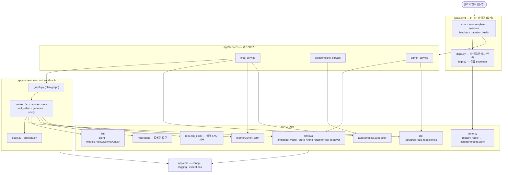
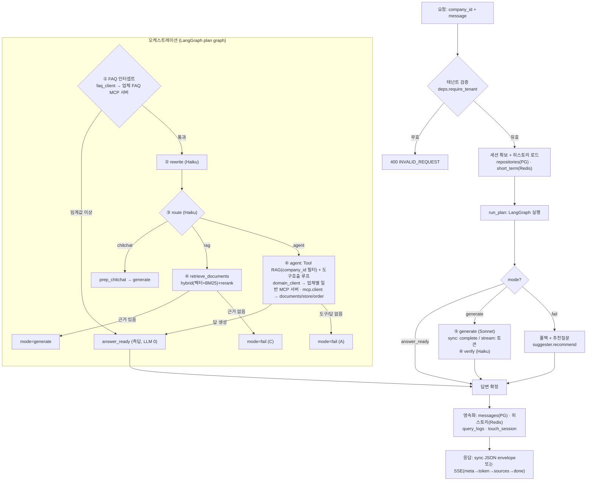
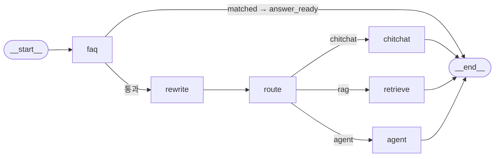
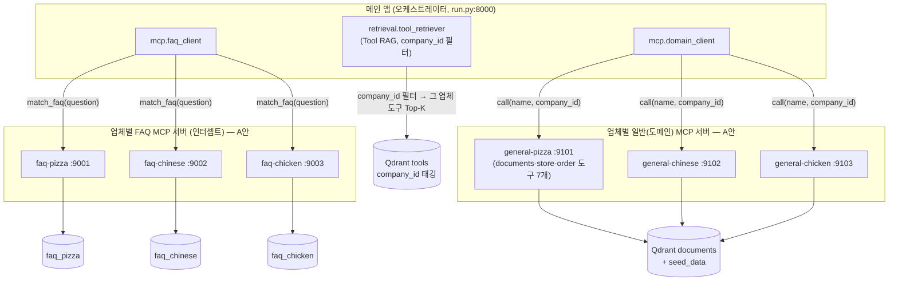
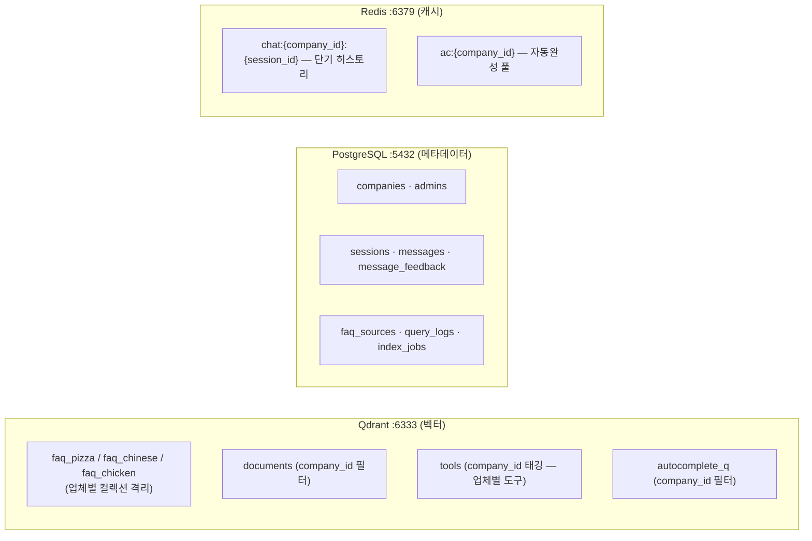
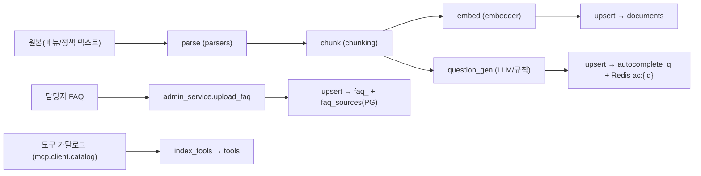

# 구현 아키텍처 (As-Built)

> **대상:** 개발팀
> **목적:** 설계서(01~11)를 바탕으로 **실제 구현된 코드**의 구조·런타임 흐름·저장소 매핑을 다이어그램으로 정리한다.
> **설계서와의 차이:** 본 문서는 "지금 코드가 이렇게 동작한다"를 기준으로 한다. 파일럿 단순화(HashEmbedder, 도메인 도구 인프로세스 등)는 그대로 반영했다. 운영 전환 항목은 [README](../README.md) "파일럿 단순화" 참고.
> **상태:** 구현 v1 (FAQ 업체별 MCP 서버 분리 반영)

---

## 1. 컴포넌트 & 의존성 (레이어)

의존 방향은 단방향: **api → services → orchestration → infra → core**. 안쪽(인프라)은 바깥(api)을 모른다.

---

## 2. 채팅 요청 런타임 흐름 (계단형 필터)

`POST /v1/chat` · `/v1/chat/sync` 한 건이 처리되는 전체 경로. **계단형 필터**로 위에서 걸러질수록 비용/지연이 작다.

> **route 값**(`faq_intercept`/`chitchat`/`rag`/`agent`)은 응답 meta·`messages.route`·`query_logs`에 기록 → 어느 단계에서 처리됐는지 분석 가능.
> LLM 키가 없으면: rewrite/route 는 기본값(rag)으로, generate 는 폴백 문구로 degrade. **FAQ 인터셉트·검색은 키 없이 동작.**

---

## 3. LangGraph 그래프 (노드/엣지)

`app/orchestration/graph.py` 의 실제 plan 그래프. 생성(generate)·검증(verify)은 그래프 직후 서비스가 호출(스트리밍/동기 공유).

| 노드 | 파일 | 모델 | 역할 |
|---|---|---|---|
| faq | `nodes/faq.py` | — | 업체 FAQ 시맨틱 인터셉트(0단계) |
| rewrite | `nodes/rewrite.py` | Haiku | 후속질문 → 독립질문 |
| route | `nodes/route.py` | Haiku | chitchat/rag/agent 분류 |
| retrieve/agent/chitchat | `nodes/tool_select.py` | Sonnet(agent) | 문서검색 / 도구호출 루프 / 잡담준비 |
| generate | `nodes/generate.py` | Sonnet | 최종 답변(스트림/동기) |
| verify | `nodes/verify.py` | Haiku | 근거 충실성 점검(선택) |

---

## 4. MCP 토폴로지 (도구 제공자)

FAQ·일반(도메인) 서버 **모두 업체별 독립 프로세스**(streamable-http)로 뜬다. 오케스트레이터는 테넌트별 URL로 MCP 프로토콜 호출, 미기동 시 인프로세스 폴백.

> **MCP 서버는 상위 `git/` 폴더의 외부 독립 프로젝트**(자체 pyproject/venv/코드, FastAPI+FastMCP).
> - FAQ: `faq-{pizza,chinese,chicken}` (포트 9001~3) ← `mcp.faq_client`
> - 일반: `general-{pizza,chinese,chicken}` (포트 9101~3, 도메인 도구 7개) ← `mcp.domain_client`
> **Tool RAG(서버 디스커버리)**: `scripts/index_tools.py` 가 각 general 서버의 MCP `list_tools` 로 도구를 발견해 `tools` 컬렉션에 `company_id` 태깅 적재(하드코딩 카탈로그 없음, 단일 출처=서버) → `tool_retriever`가 그 업체 도구로만 후보 검색 → LLM 선택 → `domain_client`가 그 업체 일반 서버에 호출.
> 오케스트레이터는 순수 MCP 클라이언트(인프로세스 도구 코드 없음). FAQ 는 서버 미가동 시 자체 retrieval 폴백,
> 일반 도구는 원격 전용. 일괄 기동: `scripts/run_external_servers.py`.

---

## 5. 데이터 저장소 매핑 (기존 로컬 도커 컨테이너)

| 컬렉션/테이블/키 | 채우는 곳 | 읽는 곳 |
|---|---|---|
| `faq_<id>` | `admin_service.upload_faq` / seed | FAQ 인터셉트(faq 서버) |
| `documents` | `indexing.pipeline` / seed | retrieve_documents, search_menu/policy |
| `tools` | `indexing.index_tools(catalog, company_id)` / seed | tool_retriever (Tool RAG, company_id 필터) |
| `autocomplete_q` · `ac:{id}` | `indexing` / seed | autocomplete.suggester |
| `sessions`·`messages`·… | `repositories` (chat_service) | sessions API, 분석 |

> **격리 전략(2단계)**: FAQ 는 **컬렉션 자체 분리**(`faq_<id>`), 나머지(documents/tools/autocomplete_q)는 **단일 컬렉션 + `company_id` payload 필터**. 모든 검색에 company_id 필터를 강제(`vector_store._company_filter`).
> **검색 가속**: 공유 컬렉션은 `company_id` 에 KEYWORD payload 인덱스(`ensure_company_index`)를 생성 → 필터 검색이 빠름(컬렉션 분리 대신 인덱스로 해결, 업체 수가 늘어도 컬렉션 폭증 없음). FAQ 는 이미 컬렉션 격리라 인덱스 불필요.
> **적재 멱등**: 모든 포인트 ID 는 결정적(문서: `<company>_<doc>_<idx>`, FAQ/질문: 내용 해시, 도구: `tool_<company>_<name>`) → 재인덱싱 시 덮어쓰기(중복 없음).
> 임베딩은 결정적 `HashEmbedder`(키 불필요). 인덱싱/질의 동일 모델 사용. 운영은 실제 임베딩 모델로 교체(§07).

---

## 6. 오프라인 인덱싱 파이프라인 (§07)

실행: `scripts/init_db.py`(스키마) → `scripts/seed_demo.py`(데모 적재).

---

## 7. 설계서 대비 구현 차이 (요약)

| 항목 | 설계(01~11) | 구현(as-built) |
|---|---|---|
| FAQ 서버 | 업체별 인스턴스 분리(A안) | ✅ 업체별 독립 프로세스/포트(9001~3), MCP 프로토콜 호출 (벡터DB는 아직 공용 컬렉션) |
| 일반(도메인) MCP | 공용 서버 | ✅ **업체별 독립 프로세스/포트(9101~3)**, MCP 프로토콜 호출. 코드 1벌(도메인 tools.py 단일 소스) |
| Tool RAG | 공용 도구 검색 | ✅ **`company_id` 필터** — 그 업체 도구로만 후보 검색(`tools` 컬렉션 업체별 태깅) |
| 임베딩 | 실제 임베딩 모델 | HashEmbedder(어휘 기반, 키 불필요) |
| 관리자 인증 | per-company 토큰 | 단일 ADMIN_TOKEN |
| 인덱싱 잡 | 비동기 워커 | 작업 기록만(워커 미구현) |
| 벡터DB 격리 | 업체별 인스턴스 | 공용 Qdrant + 컬렉션/필터(인스턴스 분리는 운영 전환) |
